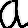
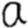
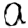
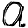
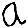
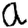
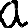

# Intermediate Project Report

## Introduction and Problem Description

Cursive writing recognition is one of the most challenging research areas in the field of image processing and pattern
recognition. Each person has a different style of writing the same alphabet. There are also variations in the text written
by the same person time to time. The development of cursive writing recognition systems has led to an improved
interaction between man and machine. Various research works have been conducted focusing on new techniques that aim at reducing the processing time while providing higher accuracy. 

Handwriting recognition can be broken up into two main categories: online and offline recognition. In the case of 
online handwriting recognition, handwriting input is analyzed as it is being written. Using a stylus to write on an 
electronic device with a touch screen falls into this category. In offline recognition, however, the text is analyzed 
after it has been written. For example, analysis of a page scanned from a book. Modern handwriting also falls into two 
categories: standard lettering, which is also known as block lettering, manuscript style, or printing, and cursive. 
Generally speaking, characters written in standard lettering are relatively simple to detect through online and offline 
methods: the letters are discrete, so it is easy to distinguish where one character ends and another begins. Cursive, 
on the other hand, poses a tougher challenge. Cursive lettering is continuous, meaning that as a word is being written, 
the utensil with which it is being written doesn’t leave the medium. The result is a chain of characters with no 
distinct separation between them. 

To address the continuity problem in offline cursive handwriting recognition, the most common approach is to segment 
the string into individual characters. The slope of the string characters must also be corrected. The quality of 
segmentation and alignment is crucial because of its impact on successful character recognition. One of the most 
successful methods of segmentation is the Ideal Distance approach, which, when used in the context of a machine 
learning model, has been shown to lead to a 97% rate of success in recognizing characters. 

Our goal with this project is to train a model that can recognize cursive handwritten characters in an image of a word
and probabilistically predict what the word is, based on the confidence of prediction accuracy. This "confidence" will
 simply be a threshold that must be crossed before a character can be assumed to be correct. 
 
#### Example with hello
 
Consider the word `"hello"` and its segmented form `{'h','e','l','l','o'}`. 
 Now, let's say that our threshold for assumed correctness 
 is `.95` or `95%`. Let's also say that the respective "confidence" levels for the individual characters are 
 `{.92, .96, .97, .70, .97}`. In this case, we will assume that the letters `'e', 'l', 'o'` were correctly predicted. This 
 can be represented by:
 
    actual word                     h e l l o
    "confident" prediction          _ e l _ o
    
Based on the "confident" prediction, further predictions will be made regarding what the word is, with consideration for
 its prevalence in the English language.
 
     actual word                     h e l l o
     "confident" prediction          _ e l _ o
     
     Word prediction:
     
        --> h e l l o               highest prevalence
                                            |
        --> c e l l o                       |
                                            |
        --> j e l l o                       |
                                            |
        --> h e l i o               lowest prevalence         
        
        
## Description of the data used in the project                  

The IDIAP dataset we had originally requested to have access to was not ideal for our purposes: the vector 
representations of the images were of many different sizes, and not all of the characters contained in the 
dataset are written in cursive. Additionally, the datatype was not easily integrable with how the project has been 
implemented so far. As a result, we chose to develop our own dataset by leveraging Evernote (a note-taking application 
IOS, macOS, Android, and Microsoft Windows), the Evernote api, python, Image Magick (a command-line-based image 
manipulation software), and a handful of generous volunteers. The general collection/processing pipeline can be 
understood as follows:

* Record handwriting data with Evernote and save all inputs with .png extension
* Pull Evernote data to device leveraging Evernote api
* Using Image Magick, trim, center, resize, and adjust color of .png images
* Convert images to MNIST format for integration into model

Even with the contributions of volunteers, we felt that our dataset was too small to effectively train a model, so, 
again using Image Magick, we made copies of the original images that were then edited and incorporated into the training
set.

#### Example with the letter 'a':

  
  
  
  
  
  
  

In order from left to right, the effects are: `None (original image), blur, dilate, gauss, octagonal convex hull, 8*degree 
rotation to the left, smooth`

As a result of the artificial increase in data, we were left with 379,600 images, which we then split into training and testing sets.
* The resulting training set has:
  * 7042 images for each character. That is, ‘a’: 7042 images, ‘A’: 7042 images, ‘b’: 7042 images, etc.
  * 366184 total images 
  
* The resulting test set has:
  * 258 images for each character
  * 13416 total images
  
## What has been done so far

#### Model
We have constructed a model utilizing a neural network that can predict *numerical digits* with an accuracy of
around 90%. This model uses the MNIST dataset for training and testing purposes.

#### Data Collection
As mentioned above, we found the IDIAP dataset to be unsatisfactory in meeting the needs of the project, so we chose
to create our own. Using our own cursive handwriting, as well as that of volunteers, we were able to construct a small
dataset. 

#### Data Generation
We found that the number of images was not enough to train our model with, so we duplicated the dataset several times over
and made adjustments to the duplicates, thus artificially increasing the size of the dataset. The images were also all 
converted to grayscale in preparation for MNIST conversion.

#### MNIST Conversion
In order for our newly collected and generated data to work with our model, we had to convert the images to MNIST 
format, which involves dividing the image into individual pixels and inserting the values into a vector. In addition to
image processing, labels were also created that identified each image.

For example:

label = a

## Remaining tasks

#### Pipelining
The project components need to be adjusted to account for the storage issues arising from GitHub. Instead of trying to 
store the entire dataset on GitHub (which is not allowed), the ideal repository should only contain the original 
images. Then, once the repository is cloned, the training and testing set generator scripts can be run to build the 
dataset locally. This will require adjusting the scripts. In a similar fashion, the program to convert the images to 
MNIST format will be run to prepare the data for training and testing. These three components should be encapsulated
in a single container that needs to be run only once. The goal pipeline is as follows:

                        -------------------------------------------------------------------------
                        |                                                                       |
                        |--> alphaTrainingGenerator.sh -->   |                                  |
    original images --> |                                    | --> convert-png-to-mnist.py -->  | --> model
                        |--> alphaTestingGenerator.sh -->    |                                  |
                        |                                                                       |
                        -------------------------------------------------------------------------

#### Model tuning
Once the pipeline has been set up and the data is properly processed, we will need to adjust the model parameters
 to where it can effectively generalise and predict.

#### Image segmentation
An additional program will need to be created that will be able to perform image segmentation and de-slanting. By 
inputting an image of, for example, the word “hello”, the program should output {“h”, “e”, “l”, “l”, “o”}. To accomplish 
this segmentation, we will be utilizing the Ideal Distance approach. Once the input has been properly segmented and 
adjusted, its discrete elements will be inserted into a vector and passed to the prediction program.

#### Word prediction
Lastly, a program will need to be constructed that can predict the word based on the predictive "confidence" of each 
character.
Characters identified with a high level of "confidence" above a specific threshold will be assumed to be correct. Based on 
this assumption, word predictions will be made based on the positively identified letters and the frequency of the word 
in the English language. A human example of this would be the game Wheel Of Fortune, where contestants guess hidden 
phrases based on the letters they know the phrase possesses. A specific example of how this portion of the project
should work is provided above, in the [*Introduction and Problem Description*](#example-with-hello) section.

