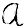

# Prediction-based Cursive English Handwriting Recognition

## Team members

- Tyler Cummings
- Eric Vo

## Description

Handwriting recognition can be broken up into two main categories: online and offline recognition. In the case of online handwriting recognition, handwriting input is analyzed as it is being written. Using a stylus to write on an electronic device with a touch screen falls into this category. In offline recognition, however, the text is analyzed after it has been written. For example, analysis of a page scanned from a book. 

Modern handwriting also falls into two categories: standard lettering, which is also known as block lettering, manuscript style, or printing, and cursive. Generally speaking, characters written in standard lettering are relatively simple to detect through online and offline methods: the letters are discrete, so it is easy to distinguish where one character ends and another begins. Cursive, on the other hand, poses a tougher challenge. Cursive lettering is continuous, meaning that as a word is being written, the utensil with which it is being written doesn’t leave the medium. The result is a chain of characters with no distinct separation between them. 

## A brief survey of what has been done and how the proposed work is different

Online recognition of cursive has been met with much success. This is largely due to the fact that actively written cursive provides directional and temporal information that aid in recognition. These traits, however, are largely absent in physical documents, and ultimately cannot be used in offline recognition to determine which letter is which. 

While segmentation during the analysis of cursive has shown promising results, it is still far from producing accurate recognitions.

The proposed project will follow the approach of segmenting words into individual characters, but then predict the word based on a number of factors: 
- Characters identified with a high level of certainty above a specific threshold will be assumed to be correct. Based on this assumption, word predictions will be made based on the positively identified letters and the frequency of the word in the English language. A human example of this would be the game Wheel Of Fortune, where contestants guess hidden phrases based on the letters they know the phrase possesses.

## Preliminary plan (milestones)

### 10/1/2019 - 11/1/2019

- A request has been made to IDIAP Research Institute to use their Cursive Character dataset. Approval is currently pending, but, according to the IDIAP website, access will likely be granted within a week of the request.
- A small number of sample documents written in cursive will be collected. Some may be handwritten by team members. 
- Following the acquisition of the character dataset, image pre-processing will need to be performed to remove image noise and enhance contrast for stronger detection.Additionally, skew correction, cropping, and resizing will need to be performed on the dataset.
- Handwritten documents will also need to go through pre-processing similar to that of the character dataset.
- Following the acquisition of the IDIAP dataset, and its subsequent pre-processing, we will train the model of choice and evaluate its results. 

## Dataset

https://www.idiap.ch/dataset/ccc

## References

[Freeform Cursive Handwriting Recognition Using a Clustered Neural Network](https://digital.library.unt.edu/ark:/67531/metadc804845/#description-content-main)

[Cursive Handwriting Recognition System Using Feature Extraction and Artificial Neural Network](https://pdfs.semanticscholar.org/8292/26f8c745645802b7d76ef3587b1c389cc173.pdf)

[Segmentation Of Off-line Cursive Handwriting Using Linear Programming](https://www.sciencedirect.com/science/article/abs/pii/S0031320398000818)

[Online Handwriting Recognition Problem: Issues and Techniques](https://pdfs.semanticscholar.org/f957/3acd8405b5c594314491dedfbeb3bf40750f.pdf)

[Study Of Various Character Segmentation Techniques For Handwritten Off-line Cursive](https://www.semanticscholar.org/paper/STUDY-OF-VARIOUS-CHARACTER-SEGMENTATION-TECHNIQUES-Kaur-Baghla/183ed0b8d77773c22e1f5f455256427b654b2d09)

[Handwriting Recognition – “Offline” Approach](https://cs.stanford.edu/people/adityaj/HandwritingRecognition.pdf)

[Offline cursive handwriting recognition system based on hybrid Markov model and neural networks](https://www.semanticscholar.org/paper/Offline-cursive-handwriting-recognition-system-on-Tay-Khalid/8476059c0d810e252249feffc21c2ea55ee8ee43)

[Off-line Cursive Handwriting Recognition Using Synthetic Training Data](http://citeseerx.ist.psu.edu/viewdoc/download?doi=10.1.1.92.9920&rep=rep1&type=pdf)

[Recognition of Cursive Roman Handwriting - Past, Present and Future](http://citeseerx.ist.psu.edu/viewdoc/download?doi=10.1.1.1.1763&rep=rep1&type=pdf)

[Recognition-based Segmentation of On-line Cursive Handwriting](https://pdfs.semanticscholar.org/2313/9cf6228053980eeffd42573c61fe5d658004.pdf)

#Intermediate Project Report

##Introduction and Problem Description

Handwriting recognition can be broken up into two main categories: online and offline recognition. In the case of 
online handwriting recognition, handwriting input is analyzed as it is being written. Using a stylus to write on an 
electronic device with a touch screen falls into this category. In offline recognition, however, the text is analyzed 
after it has been written. For example, analysis of a page scanned from a book. Modern handwriting also falls into two 
categories: standard lettering, which is also known as block lettering, manuscript style, or printing, and cursive. 
Generally speaking, characters written in standard lettering are relatively simple to detect through online and offline 
methods: the letters are discrete, so it is easy to distinguish where one character ends and another begins. Cursive, 
on the other hand, poses a tougher challenge. Cursive lettering is continuous, meaning that as a word is being written, 
the utensil with which it is being written doesn’t leave the medium. The result is a chain of characters with no 
distinct separation between them. 

To address the continuity problem in offline cursive handwriting recognition, the most common approach is to segment 
the string into individual characters. The slope of the string characters must also be corrected. The quality of 
segmentation and alignment is crucial because of its impact on successful character recognition. One of the most 
successful methods of segmentation is the Ideal Distance approach, which, when used in the context of a machine 
learning model, has been shown to lead to a 97% rate of success in recognizing characters. 

Our goal with this project is to train a model that can recognize cursive handwritten characters in an image of a word
and probabilistically predict what the word is, based on the confidence of prediction accuracy. This "confidence" will
 simply be a threshold that must be crossed before a character can be assumed to be correct. For example, consider the 
 word "hello" and its segmented form {'h','e','l','l','o'}. Now, let's say that our threshold for assumed correctness 
 is .95 or 95%. Let's also say that the respective "confidence" levels for the individual characters are 
 {.92, .96, .97, .70, .97}. In this case, we will assume that the letters 'e', 'l', 'o' were correctly predicted. This 
 can be represented by:
 
    actual word                     h e l l o
    "confident" prediction          _ e l _ o
    
Based on the "confident" prediction, further predictions will be made regarding what the word is, with consideration for
 its prevalence in the English language.
 
     actual word                     h e l l o
     "confident" prediction          _ e l _ o
     
     Word prediction:
     
        --> h e l l o               highest prevalence
                                            |
        --> c e l l o                       |
                                            |
        --> j e l l o                       |
                                            |
        --> h e l i o               lowest prevalence         
        
        
##Description of the data used in the project                  

The IDIAP dataset we had originally requested to have access to was not ideal for our purposes: the vector 
representations of the images were of many different sizes, and not all of the characters contained in the 
dataset are written in cursive. Additionally, the datatype was not easily integrable with how the project has been 
implemented so far. As a result, we chose to develop our own dataset by leveraging Evernote (a note-taking application 
IOS, macOS, Android, and Microsoft Windows), the Evernote api, python, Image Magick (a command-line-based image 
manipulation software), and a handful of generous volunteers. The general collection/processing pipeline can be 
understood as follows:

* Record handwriting data with Evernote and save all inputs with .png extension
* Pull Evernote data to device leveraging Evernote api
* Using Image Magick, trim, center, resize, and adjust color of .png images
* Convert images to MNIST format for integration into model

Even with the contributions of volunteers, we felt that our dataset was too small to effectively train a model, so, 
again using Image Magick, we made copies of the original images that were then edited and incorporated into the training
set. These adjustments include: rotation, slope, blur, thickening, and thinning.

####Example with the letter 'a':

